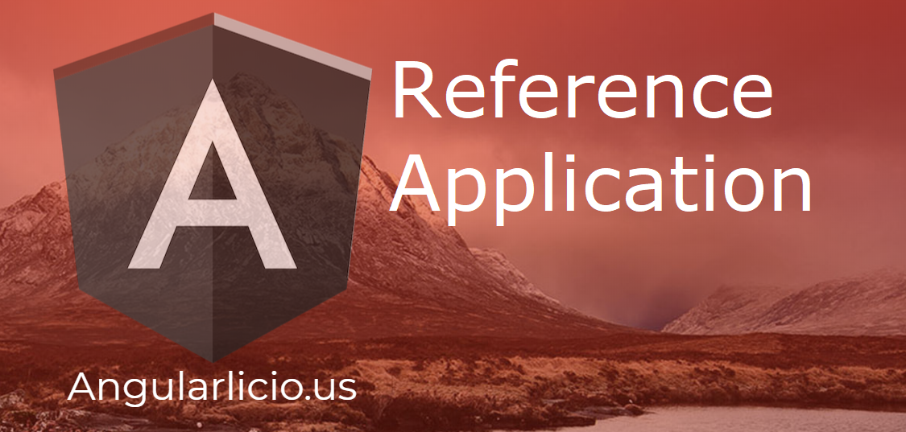

# Angularlicious Reference App



The purpose of this application is to demonstrate the use of the Angularlicious libraries/packages. 

* Cross-Cutting Concerns
    * configuration
    * error handling
    * logging
    * notifications
    * HTTP/Data Access
* Business Logic Processing
    * actions
    * business rules
    * data validation
* Feature Libraries
    * Contentful: uses 3rd-party [https://www.contentful.com](https://www.contentful.com) API to manage JSON-based content.
    * Firebase: uses Firebase for authentication and user management
    * Markdown Editor: a library for managing markdown content.
* Security
    * manages login
    * password changes
    * password reset
    * account creation
    * account verification
  
The reference application

```ts
ng generate application reference-app --style=scss --routing
CREATE apps/reference-app-e2e/protractor.conf.js (752 bytes)
CREATE apps/reference-app-e2e/src/app.e2e-spec.ts (310 bytes)
CREATE apps/reference-app-e2e/src/app.po.ts (219 bytes)
CREATE apps/reference-app-e2e/tsconfig.e2e.json (244 bytes)
CREATE apps/reference-app/src/environments/environment.prod.ts (51 bytes)
CREATE apps/reference-app/src/environments/environment.ts (631 bytes)
CREATE apps/reference-app/src/favicon.ico (5430 bytes)
CREATE apps/reference-app/src/index.html (321 bytes)
CREATE apps/reference-app/src/main.ts (370 bytes)
CREATE apps/reference-app/src/polyfills.ts (3194 bytes)
CREATE apps/reference-app/src/test.ts (642 bytes)
CREATE apps/reference-app/src/assets/.gitkeep (0 bytes)
CREATE apps/reference-app/src/styles.scss (80 bytes)
CREATE apps/reference-app/browserslist (375 bytes)
CREATE apps/reference-app/karma.conf.js (967 bytes)
CREATE apps/reference-app/tsconfig.app.json (254 bytes)
CREATE apps/reference-app/tsconfig.spec.json (315 bytes)
CREATE apps/reference-app/tslint.json (269 bytes)
CREATE apps/reference-app/src/app/app.module.ts (485 bytes)
CREATE apps/reference-app/src/app/app.component.html (607 bytes)
CREATE apps/reference-app/src/app/app.component.spec.ts (1114 bytes)
CREATE apps/reference-app/src/app/app.component.ts (230 bytes)
CREATE apps/reference-app/src/app/app.component.scss (0 bytes)
UPDATE angular.json (30824 bytes)
UPDATE package.json (6652 bytes)
UPDATE nx.json (1051 bytes)
```

asdf

```ts
ng update --all
Package "@nrwl/nx" has an incompatible peer dependency to "jasmine-marbles" (requires "0.4.0", would install "0.4.1").                  
Package "@ngrx/store" has an incompatible peer dependency to "@angular/core" (requires "^6.0.0", would install "7.1.1")
Package "@ngrx/router-store" has an incompatible peer dependency to "@angular/common" (requires "^6.0.0", would install "7.1.1")                  
Package "ng-packagr" has an incompatible peer dependency to "typescript" (requires ">= 2.7 <3.2", would install "3.2.1")
Package "@nrwl/nx" has an incompatible peer dependency to "jasmine-marbles" (requires "0.4.0", would install "0.4.1")                  
Package "@angular/compiler-cli" has an incompatible peer dependency to "typescript" (requires ">=3.1.1 <3.2", would install "3.2.1")                  Package "@ngrx/effects" has an incompatible peer dependency to "@angular/core" (requires "^6.0.0", would install "7.1.1")
Package "ng-packagr" has an incompatible peer dependency to "typescript" (requires ">= 2.7 <3.2", would install "3.2.1").
Incompatible peer dependencies found. See above.
```

removed from package.json
```ts
"@ngrx/effects": "6.0.1",
"@ngrx/router-store": "6.0.1",
"@ngrx/store": "6.0.1",
"@ngrx/store-devtools": "6.0.1",
"@nrwl/nx": "6.1.0",
  "ngrx-store-freeze": "0.2.2",
```

removed from devDependencies

```ts
"@angular/compiler-cli": "^6.0.7",
"@angular-devkit/build-angular": "^0.6.8",
"@angular-devkit/build-ng-packagr": "~0.6.1",
"@ngrx/schematics": "6.0.1",
"@nrwl/schematics": "6.1.0",
"ng-packagr": "^3.0.3",
```

NPM install: ` npm install -D @nrwl/schematics @nrwl/nx`

